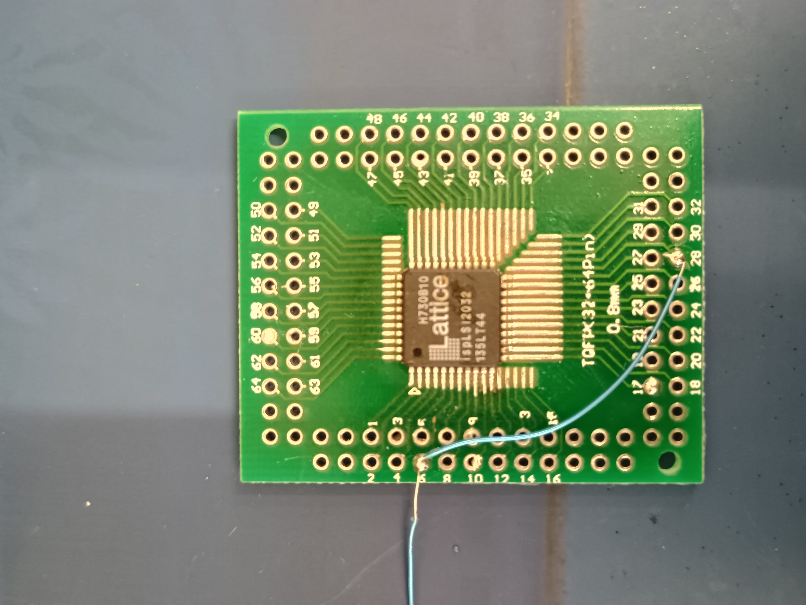

# ispLSI2032 — Lattice ispLSI 2000 Family

Available on donor PCBs in the lab.

## VOLTAGE WARNING

The ispLSI 2032 family has **multiple voltage variants**:

| Variant        | VCC      | ISP         | JTAG                   | FT2232H direct?   | IDCODE     |
|----------------|----------|-------------|------------------------|--------------------|------------|
| ispLSI 2032    | **5V**   | Hidden JTAG | **Yes**                | YES (5V tolerant)  | TBD        |
| ispLSI 2032A   | **5V**   | Hidden JTAG | **Yes**                | YES (5V tolerant)  | TBD        |
| ispLSI 2032V   | **3.3V** | IEEE 1532   | **Yes** (IR=5)         | YES                | 0x00301043 |
| ispLSI 2032VL  | **3.3V** | IEEE 1532   | **Yes** (IR=5)         | YES                | TBD        |
| ispLSI 2032E   | **5V**   | IEEE 1532   | **Yes** (IR=5)         | YES (5V tolerant)  | 0x00A4E043 |
| ispLSI 2032VE  | **3.3V** | IEEE 1532   | **Yes** (IR=5) + BScan | YES                | 0x10301043 |

**FT2232H is +5V tolerant on all I/O** — direct connection to ALL variants, no level shifter!
- "Legacy ISP" is actually JTAG with different pin names (Lattice patent US5412260A)
- All variants have JTAG capability
- For 5V chips: FT2232H outputs 3.3V HIGH → accepted as HIGH (VIH >= 2.0V)
- Hold ispEN (pin 7) LOW to enable JTAG mode

## Device Summary

| Parameter | Value |
|-----------|-------|
| Family | ispLSI 2000 |
| Macrocells | 32 (8 GLB x 4) |
| I/O pins | 32 + 2 dedicated inputs |
| Clock pins | 3 dedicated (Y0, Y1, Y2) |
| OE pins | 1 dedicated (GOE 0) |
| IR length | 5 bits (JTAG variants only) |
| JTAG | V/VL/E variants only |
| ISP | Legacy serial (2032/A) or IEEE 1532 (V/VL/E) |
| Architecture | GLB (AND/OR/XOR array) |
| Density | ~1K PLD gates |
| fMAX | 180 MHz (-180 grade) |
| Interconnect | Global Routing Pool (GRP) |
| Erase cycles | 10,000 (ispLSI) |
| Data retention | 20 years |
| Technology | E²CMOS |

## Architecture

- 8 Generic Logic Blocks (GLBs): A0..A7, 4 macrocells each
- Each GLB: 18 inputs from GRP, programmable AND/OR/XOR array
- Macrocell: combinatorial or registered output
- Global Routing Pool (GRP): full interconnect between all GLBs
- Output Routing Pool (ORP): connects GLB outputs to I/O cells
- 3 dedicated clock pins (Y0, Y1/RESET, Y2/SCLK)
- 1 global output enable (GOE 0)

## Packages

| Package | Pins | Suffix |
|---------|------|--------|
| PLCC | 44 | -xLJ44 |
| TQFP | 44 | -xLT44, -xLTN44 |
| TQFP | 48 | -xLTN48 |

## ISC Instructions (JTAG variants: V/VL/E)

From BSDL (bsdl.info), IR length = 5 bits:

| Instruction | Opcode | Description |
|-------------|--------|-------------|
| ISC_ENABLE | 10101 | Enter ISC mode |
| ISC_DISABLE | 11110 | Exit ISC mode |
| ISC_ADDRESS_SHIFT | 00001 | Load row address |
| ISC_DATA_SHIFT | 00010 | Shift fuse data |
| ISC_READ | 01010 | Read fuse row |
| ISC_ERASE | 00011 | Erase device |
| ISC_NOOP | 11001 | No operation |
| ISC_DISCHARGE | 10100 | Discharge programming voltage |
| ISC_PROGRAM_SECURITY | 01001 | Set security fuse |
| IDCODE | 10110 | Read JTAG IDCODE |

IDCODE: To be determined from device scan (not yet available).

## JTAG Pins (V/VL/E variants)

Standard 4-wire JTAG: TCK, TDI, TDO, TMS

## Legacy ISP Pins (all variants)

| Pin | 44-TQFP | Function (ISP mode) | Function (normal) |
|-----|---------|--------------------|--------------------|
| ispEN | 7 | Enable ISP (active low) | NC |
| SDI/IN0 | 8 | Serial data in | Dedicated input |
| SDO/IN1 | 18 | Serial data out | Dedicated input |
| MODE | 30 | ISP state control | NC |
| SCLK/Y2 | 27 | Serial clock | Clock Y2 |

## TQFP44 → DIP Adapter Wiring

Universal TQFP 32~64pin adapter (0.8mm pitch).  Pin 1 is **top-left** on TQFP44.



The adapter has 64 holes but only 44 are used.  Each side has a gap of 5 unused holes:

| Chip pins | Adapter holes | Offset |
|-----------|---------------|--------|
|  1 – 11   |  1 – 11       | +0     |
| 12 – 22   | 17 – 27       | +5     |
| 23 – 33   | 33 – 43       | +10    |
| 34 – 44   | 49 – 59       | +15    |

### FT2232H → Adapter Wiring (7 wires)

| Adapter holes | Signal        | FT2232H    |
|---------------|---------------|------------|
|  6, 38        | VCC           | +5V        |
|  7            | ispEN         | GND        |
|  8            | SDI (TDI)     | ADBUS1     |
| 22, 54        | GND           | GND        |
| 23            | SDO (TDO)    | ADBUS2     |
| 37            | SCLK (TCK)   | ADBUS0     |
| 40            | MODE (TMS)   | ADBUS3     |

## OpenOCD Quick Test (JTAG variants only)

```bash
openocd -f ../../ft2232h/ft2232h_smooker.cfg \
    -c "adapter speed 1000; transport select jtag" \
    -c "jtag newtap auto0 tap -irlen 5" \
    -c "init"
```

## Speed Grades

| Grade | fmax (MHz) | tpd (ns) |
|-------|-----------|----------|
| -180 | 180 | 5.0 |
| -150 | 154 | 5.5 |
| -135 | 137 | 7.5 |
| -110 | 111 | 10.0 |
| -80 | 84 | 15.0 |

## vs M4A3-64/32

|             | ispLSI2032          | M4A3-64/32     |
|-------------|---------------------|----------------|
| Macrocells  | 32 (8x4)           | 64 (4x16)      |
| IR length   | 5 bits              | 10 bits        |
| Blocks      | 8 GLB x 4 MC       | 4 PAL x 16 MC  |
| GLB inputs  | 18                  | 33             |
| VCC         | 5V or 3.3V (V/VL)  | 3.3V           |
| ISP         | Legacy or IEEE 1532 | IEEE 1532      |
| Fuse access | TBD                 | Fully decoded  |
| fmax        | 180 MHz             | 250 MHz        |

## TODO

- [x] **Identify exact variant**: ispLSI 2032-135LT44 (5V, 137MHz, plain 2032)
- [x] Desolder from donor PCB (Cognex TURBO ACR/M/ALRM 2.0)
- [x] Mount on TQFP44→DIP adapter
- [ ] **JTAG scan — will it return IDCODE?** (the bet!)
- [ ] Download BSDL from bsdl.info (needs CAPTCHA)
- [ ] Decode full ISC protocol (register sizes TBD)
- [ ] Determine fuse geometry
